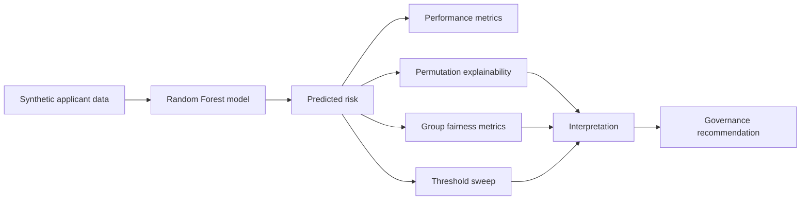

# Credit Risk XAI & Fairness Audit

[](https://github.com/jlmendez/credit-risk-xai-audit/actions/workflows/ci.yml)

An end-to-end audit of a synthetic credit-scoring system covering **predictive performance, explainability, fairness, threshold sensitivity and governance**.

## Audit workflow



The central idea is that a credit model is not only a prediction system. It is also a **decision system**, so model quality must be examined together with decision behavior across groups.

## What this demonstrates

- reproducible synthetic credit-risk data generation;
- Random Forest scoring pipeline;
- permutation-based global explainability;
- approval, opportunity and bad-approval metrics by group;
- selection-ratio and opportunity-gap summaries;
- bootstrap uncertainty for fairness indicators;
- threshold sensitivity analysis;
- explicit governance logic separating performance from fairness.

## Validation signals

| Check | Expected behavior |
|---|---|
| Identical decision behavior across groups | selection ratio close to `1.0` |
| Equal favorable opportunity | opportunity gap close to `0.0` |
| Bootstrap fairness interval | returns lower / median / upper quantiles |
| CI | runs the audit-property tests on every push / pull request |

## Repository structure

```text
.
├── notebooks/
│   ├── README.md
│   └── xai_audit_walkthrough.ipynb
├── src/
│   ├── audit_demo.py
│   ├── data_generation.py
│   ├── explainability.py
│   ├── fairness_metrics.py
│   ├── governance.py
│   └── threshold_analysis.py
├── tests/
│   └── test_fairness_metrics.py
├── .github/workflows/
│   └── ci.yml
└── requirements.txt
```

## Run

```bash
python -m venv .venv
# Windows: .venv\Scripts\activate
# Linux/macOS: source .venv/bin/activate
pip install -r requirements.txt
python src/audit_demo.py
```

Run the automated checks with:

```bash
pip install pytest
pytest -q
```

## Portfolio context

This repository is a production-style refactoring of a broader analytical workflow on explainable AI, fairness, proxy variables, mitigation and model governance. The public version uses synthetic data so the complete audit logic can be inspected without exposing private financial information.
